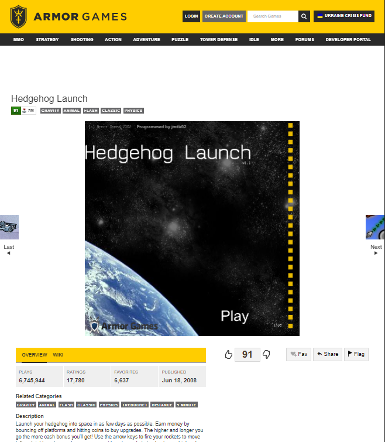

1. preload sound
2. 

# JavaScript Webgames

Jack's Retro Games is a fun website with 2 games on it. These games are meant to give the user a positive emotional experience by reminding them of fun games from the past. The games are simple and easy to use so the site is accessible to a wide audience.

## Overarching style

This theme was meant to be a blend of retro arcade colours from the colour palette and the general wireframe structure of old flashgame websites like newsground.

I chose this style for both the nostalgia and also the efficacy of it. There is very little going on on the screen so minimal distractions while youre trying to play. 

## Purpose

I spent alot of my childhood playing free videogames from the online community so the purpose of my game is to be fun and the value of the game would be it is a good way to relieve stress. I chose these particular games as they are fun but have a low skill floor as to not put off more casual gamers. Additionally the Merge City has alot of replayability as there is a random start position and order of new socket types. 

## Deployment

I deployed my site using github pages

## Features - Merge</h2>

### Score

This section is there to add a competitive aspect to the game. To allow you to feel like youre playing against other people by being able to compare highscores, like in the arcade game age. However if you start off poorly or make a mistake I thought it would be useful to be able to restart. This minimises frustration and time spent playing the game but not enjoying it. The scoring system is combining 3 grass gets you 100 points, every level above has the number of points multiplied by 4 to incentivise merging to those higher houses and huts not just getting many bushes. If 4 or more objects are combined in one go you get 50% more points and to indicate this there are slightly more detailed sprites with flowers or apples. 

    

### How To Play

While game testing on fellow code institute pupils I realised what seemed intuitive to me wasn't to them so added an explanation of what to do. This Will hopefully minimise the time playing the game but not understanding, so people dont get put off in the first few minutes of playing.

### Main Body

This is large and central on the screen. It is a 6 by 6 bootstrap grid and contains sprites of the different types of sockets. This is how you interact with the game. It hadto be central as it was the most important part of the website. The green background was chosen to resemble basic grass and the empty socket yellow colour was chosen to look like dirt. This means when youve filled it up with many trees and houses it looks more like a town than just squares.

   

### Queue

I realised the game is very difficult if you dont know what the next type is coming up and also very boring if it is always grass. The queue shows you what is coming up next allowing you to plan ahead. This random aspect of whats coming next adds replayability to the game and also the ability to know whats coming next raises the skill ceiling and allows you to plan ahead more.

     

### Sprites

All the sprites were made on piskel by tracing previous pixel art. The special additions were from my own ideas. I chose pixel art as it is easier to edit in my opinion. Below are examples of the tree sprite and the special tree sprite gained by combining 3 and 4+ bushes respectively.

     
   

## How the code works - Merge

The code initialises a class of socket objects and then works by altering the atributes of each socket then periodically updating what each socket should look like on the html. The logic of the merge function is when 3 or more sockets are connected (directly adjacent not diagonal) there must be atleast 1 socket with a type match with two of its neighbors. When this condition is satisfied it sets an attribute of readyToMerge to true and propagates this attribute value to all connected sockets. Once the value has stopped propagating it merges the sockets setting the most recently placed one to the value above its current, and the others back to empty. If 4 or more are connected then more points are rewarded and a slightly different sprite is shown. When no socket has the type attribute empty it is assumed that the game is lost and ends the game. The end game opens up a modal to reset the game and displays the final score.

## Features - Snake

### Main Body

This  is how you interact with the game. It displays the snake and food in distinct colours. It is a HTML canvas and is locked at an aspect ratio of 1:1.

### Score

As a game I was focused on making it feel very visual and when you do something well you can see the score ticking up. This is why I felt the length was a nice addition to remind the player how well theyre doing.

### Buttons

They allow the player to customise the difficulty. Through my own experiences I have found that if the game is not hard enough or impossible I find it very unenjoyable. The difficulty buttons allow players to have a tuned experience. These buttons change the size of the grid and speed the snake. 

## How the code works - Snake

The code works similarly to merge by having a class of tile objects and displaying them using a canvas. However, the snake game is directed using the arrow keys not the mouse and auto moves after a set time period. This logic works by changing the head position relative to a global direction variable. If the head tile moves either out of bounds or over a current snake tile then the game ends. If the head moves over a food tile then the global length variable is incremented by one the food attribute is set back to false and a new random tile is made a food tile. The age of the snake tile is used to calculate how long the snake should be and when a snake tile gets too old it is converted back to a blank tile.

## Future Features

### Leaderboard

Because of how my javascript is set up alot of the values are public and able to be edited from the command line. This means that someone could break the code and add values or names I do not want being displayed in the webpage. Lacking time and sufficient knowledge to protect the code I decided to not add this into my game.

### Snake Grid Slider

Ideally I wanted a slider to be able to set the difficulty of the game. Due to the time pressure of the project, I couldnt add this function.

## JS validator

There was alot of code but only one warning. This was too complex for me to change and only lead to confusion.
Functions declared within loops referencing an outer scoped variable may lead to confusing semantics. (socketArr, socketEl,soundNum, refreshSockets, merge, checkEnd, endGame)

## HTML validator

## CSS validator

## LightHouse

The performance of the sight was low. I feel like adding a load the game button would improve performance. Additionally, I had to preload the sound files for performance improvements.

## Known Bugs - Merge

If the random starting position results in 3 grass being nexto eachother then they will combine at the start. This was ideal as it added variance to the starting positions but the score doesnt reset to 0 and special attribute doesnt reset to false. This means you can start with points. This doesnt affect functionality in the game but does make it look less professional and thought out.
There are some inconsistencies with whether the special atribute is passed upwards to the socket made from merging special socket. This hasn't been fully playtested but has been noticed sometimes.
If the sockets are ever full it ends the game, even if they have the possibility of merging down and freeing sockets.

## Acknowledgements
Richey Malhotra - Supervisor
Bootstrap framework
Piskel - Sprite design